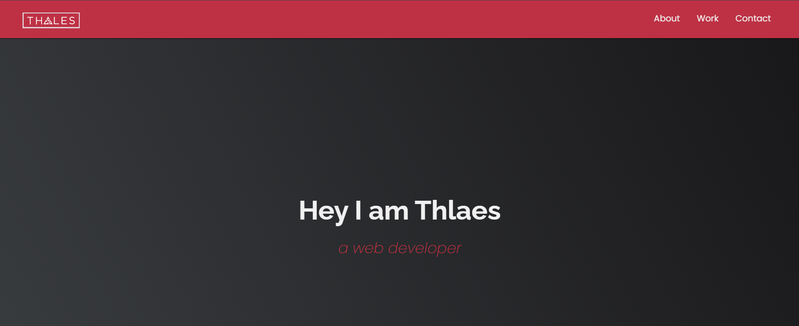

# FreeCodeCamp Personal Portfolio

A responsive personal portfolio website built as part of the **FreeCodeCamp Responsive Web Design Certification**. This project demonstrates modern web development skills using vanilla HTML, CSS, and JavaScript.

## 🎯 Project Overview

This project is part of the **FreeCodeCamp Responsive Web Design Certification** curriculum. It serves as the final project to demonstrate proficiency in:

- HTML5 semantic markup
- CSS3 responsive design principles
- JavaScript DOM manipulation
- Mobile-first development approach
- Accessibility best practices

### FreeCodeCamp Requirements Met:
- ✅ Responsive design that works on all device sizes
- ✅ Navigation section with smooth scrolling
- ✅ Welcome section with hero content
- ✅ Projects section showcasing work
- ✅ Contact section with social links
- ✅ Uses CSS Grid and/or Flexbox for layout
- ✅ Includes media queries for responsiveness

## 🌟 Preview



**Live Demo**: [View Portfolio](https://thalesmar.github.io/freeCodeCamp-Personal-Portfolio/) <!-- Update with actual GitHub Pages URL -->

- **Responsive Design**: Fully responsive layout that works seamlessly across desktop, tablet, and mobile devices
- **Interactive Navigation**: 
  - Clean navigation bar for desktop
  - Collapsible sidebar menu for mobile and tablet devices
- **Project Portfolio**: Grid-based project showcase with hover effects
- **Contact Integration**: Social media links and contact information
- **Modern UI**: Clean, professional design with smooth animations
- **Cross-browser Compatible**: Works on all modern web browsers
- **Fast Loading**: Optimized vanilla JavaScript - no heavy frameworks

## 🚀 Demo

[Live Demo](https://thalesmar.github.io/freeCodeCamp-Personal-Portfolio/) | [FreeCodeCamp Profile](https://www.freecodecamp.org/Thalesmar) <!-- Update with actual URLs -->

## 🛠️ Technologies Used

- **HTML5** - Semantic markup and structure
- **CSS3** - Styling, animations, and responsive design
- **JavaScript (ES6+)** - Interactive functionality and DOM manipulation
- **CSS Grid & Flexbox** - Modern layout techniques

## 📱 Responsive Breakpoints

- **Desktop**: 1024px and above
- **Tablet**: 768px - 1023px
- **Mobile**: Below 768px

## 🏗️ Project Structure

```
freeCodeCamp-Personal-Portfolio/
├── index.html              # Main HTML file
├── css/
│   ├── style.css          # Main stylesheet
│   └── responsive.css     # Media queries (if separate)
├── js/
│   └── script.js          # JavaScript functionality
├── images/
│   ├── projects/          # Project screenshots
│   └── profile/           # Profile images
├── READMEimg/
│   └── ProjectScreen.png  # README preview image
└── README.md              # Project documentation
```

## 🚀 Getting Started

### Prerequisites

- A modern web browser (Chrome, Firefox, Safari, Edge)
- Text editor (VS Code, Sublime Text, etc.) for modifications

### Installation

1. **Clone the repository**
   ```bash
   git clone https://github.com/Thalesmar/freeCodeCamp-Personal-Portfolio.git
   ```

2. **Navigate to the project directory**
   ```bash
   cd freeCodeCamp-Personal-Portfolio
   ```

3. **Open in browser**
   ```bash
   # Option 1: Double-click index.html
   # Option 2: Use a local server (recommended)
   python -m http.server 8000
   # or
   npx serve
   ```

4. **View the portfolio**
   - Direct file: Open `index.html` in your browser
   - Local server: Navigate to `http://localhost:8000`

## 🎨 Customization

### Personal Information
1. Update the content in `index.html` with your information
2. Replace project images in the `images/projects/` directory
3. Update social media links in the contact section

### Styling
1. Modify colors, fonts, and layout in `css/style.css`
2. Adjust responsive breakpoints as needed
3. Add your brand colors and typography preferences

### Projects
1. Add your project details in the portfolio section
2. Include project images, descriptions, and links
3. Update the grid layout if adding more projects

## 📋 Sections Included

- **Hero/Landing** - Introduction and call-to-action
- **About** - Personal information and skills
- **Portfolio** - Project showcase with descriptions
- **Contact** - Social links and contact information

## 🌐 Browser Support

- Chrome (latest)
- Firefox (latest)
- Safari (latest)
- Edge (latest)
- Internet Explorer 11+ (with minor limitations)

## 📈 Performance Features

- Optimized images for web
- Minified CSS and JavaScript (in production)
- Efficient DOM manipulation
- Lazy loading for images (if implemented)

## 🤝 Contributing

1. Fork the repository
2. Create a feature branch (`git checkout -b feature/amazing-feature`)
3. Commit your changes (`git commit -m 'Add amazing feature'`)
4. Push to the branch (`git push origin feature/amazing-feature`)
5. Open a Pull Request

## 📄 License

This project is open source and available under the [MIT License](LICENSE). Created for educational purposes as part of the FreeCodeCamp curriculum.

## 👤 Author

**Thales**
- GitHub: [@Thalesmar](https://github.com/Thalesmar)
- FreeCodeCamp: [Profile](https://www.freecodecamp.org/Thalesmar) <!-- Update with actual profile -->
- Portfolio: [Live Site](https://thalesmar.github.io/freeCodeCamp-Personal-Portfolio/)

## 🙏 Acknowledgments

- [FreeCodeCamp](https://www.freecodecamp.org/) for the excellent curriculum and project guidance
- The FreeCodeCamp community for support and inspiration
- Modern portfolio design trends and best practices
- Open source community for resources and tools

## 🎓 Certification

This project is part of the **FreeCodeCamp Responsive Web Design Certification**. 

[View Certification](https://www.freecodecamp.org/certification/Thalesmar/responsive-web-design) <!-- Update when earned -->

## 📊 Project Status

🟢 **Complete** - FreeCodeCamp certification project finished and deployed

---

⭐ **Star this repository if you found it helpful!**